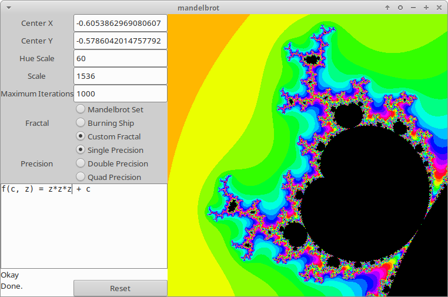
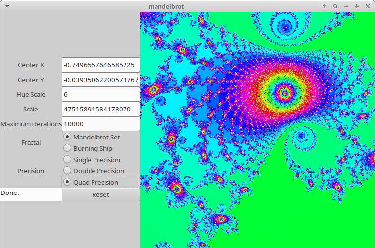

# Mandelbrot/Fractal Viewer


## Requirements

* amd64 Linux (other archs/platforms may work but have not been tested. Only unix-like platforms with the `memfd_create` system call will work with custom fractals).
* Cargo + Rust ([rustup](http://rustup.rs)). Nightly is required for custom fractals.
* `libgtk-3-dev`, `libgtk-3-0`. Gcc with `_Float128` support is required for custom fractals.

## Building and Running

To run with custom fractals enabled:

```
cargo +nightly run --bin mandelbrot --release
```
To run with custom fractals disabled:

```
cargo +stable run --bin mandelbrot --release --no-default-features
```

## Examples

(With custom fractals enabled)



(With custom fractals disabled)

